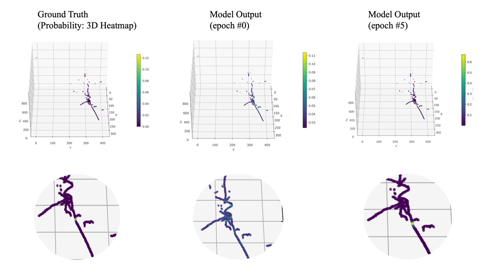

# SCN-Vertex: SparseConvNet-Based Vertex Finding in LArTPC

**SCN-Vertex** is a 3D vertex finding framework for Liquid Argon Time Projection Chambers (LArTPCs), based on [SparseConvNet](https://github.com/facebookresearch/SparseConvNet). It implements a sparse convolutional neural network, as described in [MicroBooNE Collaboration et al 2022 JINST 17 P01037](https://iopscience.iop.org/article/10.1088/1748-0221/17/01/P01037), to directly localize interaction vertices from 3D ionization charge distributions, achieving high efficiency and sub-voxel resolution.

## Overview

SCN-Vertex processes sparse 3D point cloud data (e.g., reconstructed ionization charge) and produces voxel-level probability heatmaps indicating the predicted interaction vertex location. This repository provides a clean, modular implementation of the original model architecture, refactored for easier reuse and extension.

<sub>*This implementation is an independent refactor and may not match the original codebase exactly.*</sub>


*Figure: Example of a predicted vertex heatmap overlaid on input 3D cloud points. Higher values (closer to 1) indicate a higher probability of being the true primary interaction vertex.*

### Key Features

- Sparse 3D convolution using SparseConvNet
- High-resolution, memory-efficient processing of LArTPC data
- Batch processing support with PyTorch DataLoader

## Installation

1. Create and activate a Python virtual environment:

```bash
python3 -m venv scn-venv
source scn-venv/bin/activate
```

2. Install required Python packages:

```bash
pip install torch numpy matplotlib tqdm pandas uproot awkward
```

3. Clone and install SparseConvNet:

```bash
git clone https://github.com/facebookresearch/SparseConvNet.git
cd SparseConvNet
python setup.py install
```
*Note: Ensure you have the necessary build tools (like CMake, C++ compiler) required by SparseConvNet.*

## Usage

### Data Format

The input data is typically provided via a CSV file listing paths to individual data files (e.g., `.root` or similar). Each data file should contain sparse tensor information, usually including:

- `coords`: shape `[N, 3]` — 3D spatial coordinates (voxel indices) of each point.
- `features`: shape `[N, C]` — Per-point features (e.g., charge deposition).
- `target`: shape `[N, 1]` — Per-point target values, often representing the proximity or probability of being the true vertex (e.g., derived from a Gaussian distribution centered on the true vertex).

### Training

Run the training script using:

```bash
python train.py [OPTIONS]
```

Common training parameters can be adjusted via command-line arguments. Use `python train.py --help` to see available options, such as:
- `--file-list`: Path to the input data file list.
- `--epochs`: Number of training epochs.
- `--batch-size`: Training batch size.
- `--lr`: Learning rate.
- `--num-samples`: Number of samples to load from the dataset.

## Citation

If you use this code or the underlying method in your work, please cite the original paper:

```
@article{MicroBooNE:2021ojx,
    author = "Abratenko, P. and others",
    collaboration = "MicroBooNE",
    title = "{Wire-cell 3D pattern recognition techniques for neutrino event reconstruction in large LArTPCs: algorithm description and quantitative evaluation with MicroBooNE simulation}",
    reportNumber = "FERMILAB-PUB-21-509-ND",
    doi = "10.1088/1748-0221/17/01/P01037",
    journal = "JINST",
    volume = "17",
    number = "01",
    pages = "P01037",
    year = "2022"
}
```

## Acknowledgments

This work is based on the vertex finding framework developed as part of the [Wire-Cell](https://lar.bnl.gov/wire-cell/) project and utilizes [SparseConvNet](https://github.com/facebookresearch/SparseConvNet). Special thanks to the original authors.
